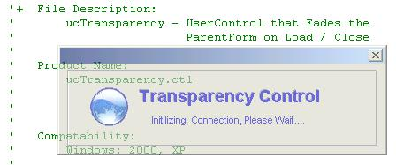



## Transparency Control

### Description

Looking for a method to produce transparency fading on forms that easy to use, lightweight (~9kb), and provides a clean method to subclass your forms Load/Unload events? Then this simple Transparency Control is for you! Just drop the control on the form and the rest is done for you…
 
### More Info
 

             |
---                |---
**Submitted On**   |2005-04-04 18:37:18
**By**             |[TerriTop](https://github.com/Planet-Source-Code/PSCIndex/blob/master/ByAuthor/territop.md)
**Level**          |Beginner
**User Rating**    |4.8 (24 globes from 5 users)
**Compatibility**  |VB 4\.0 \(32\-bit\), VB 5\.0, VB 6\.0, VB Script, VBA MS Access, VBA MS Excel
**Category**       |[Custom Controls/ Forms/  Menus](https://github.com/Planet-Source-Code/PSCIndex/blob/master/ByCategory/custom-controls-forms-menus__1-4.md)
**World**          |[Visual Basic](https://github.com/Planet-Source-Code/PSCIndex/blob/master/ByWorld/visual-basic.md)
**Archive File**   |[Transparen187215442005\.zip](https://github.com/Planet-Source-Code/territop-transparency-control__1-59834/archive/master.zip)

